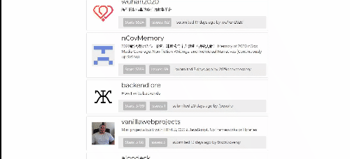

# github-API
A small webapp lists the most starred Github repos that were created in the last 30 days. 

    

## Installation and Launch
	clone/pull the repository
	cd github-API
	npm install
    npm start

## Usage 
you can check the webapp <a href="https://featured-repositories.herokuapp.com/">here</a>
This app was made using github api which allows only the first 1000 results

